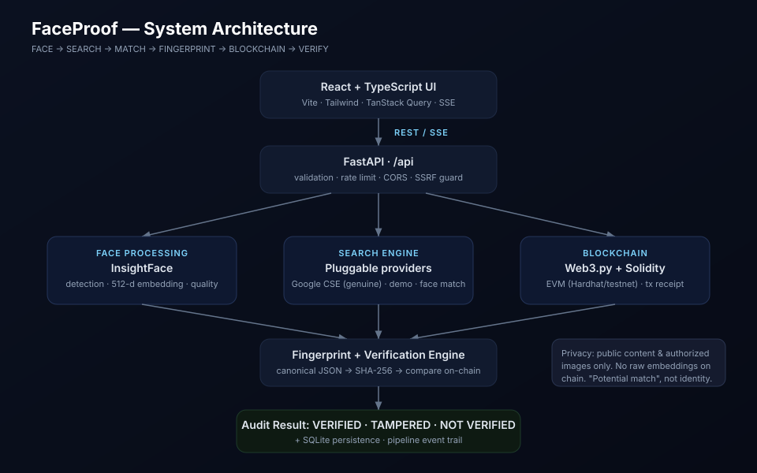

# FaceProof — Face Identification & Blockchain Verification

> **HH Goa 2026 · Shortlisting Task 3**
> A production-quality hackathon prototype that runs the full pipeline:
> **FACE → SEARCH → MATCH → FINGERPRINT → BLOCKCHAIN → VERIFY** — with genuine
> execution at every stage.

<p align="center"></p>

> ⚠️ **Use only images you own or have permission to process. Search results are
> limited to publicly accessible content. A similarity score indicates a
> _potential_ match, not a definitive identity.** FaceProof is a content-provenance
> tool, not a surveillance system.

---

## Problem

Manipulated media and impersonation are hard to disprove. Given a face image,
can we (a) discover where genuinely matching **public** content appears, (b)
capture that evidence as a tamper-evident cryptographic fingerprint, and (c)
anchor it on a blockchain so anyone can later verify it hasn't been altered?

## Solution

```
Face Detection → Web Discovery → Candidate Matching → Evidence Hashing
→ Blockchain Registration → Independent Verification (tamper detection)
```

Every stage is real:

- **Face** — InsightFace detects the target face and produces a 512-d embedding.
- **Search** — a pluggable provider does a genuine query (Google Programmable
  Search) or uses a clearly-labeled demo dataset — never a hardcoded result.
- **Match** — each candidate image is downloaded and its face compared to the
  input with cosine similarity against a configurable threshold.
- **Fingerprint** — the selected evidence is canonicalized and hashed with
  SHA-256.
- **Blockchain** — the fingerprint is registered on an EVM chain via a Solidity
  contract and Web3.py; the tx hash / block / record id are returned.
- **Verify** — the fingerprint is independently recomputed and compared to the
  on-chain record → `VERIFIED`, `TAMPERED`, or `NOT_VERIFIED`.

## Features

- Drag-and-drop / click / **camera** upload (JPG, PNG, WebP) with dimension,
  size, face-count and quality feedback.
- Animated, real-time pipeline visualization driven by **Server-Sent Events**.
- Face detection with bounding box, confidence and quality; 512-d embedding
  (raw vector never exposed — only a non-invertible `embedding_id`).
- Genuine, provider-abstracted public search + candidate face comparison, with
  ranking and a configurable match threshold.
- Deterministic **canonical JSON → SHA-256** evidence fingerprinting.
- Solidity `ContentVerification` contract (`registerRecord` / `getRecord` /
  `verifyRecord` + `RecordRegistered` event) on local Hardhat or any EVM testnet.
- Strong verification UI: current vs on-chain hash comparison, integrity %, and
  a **one-click tamper simulation** proving the check actually detects changes.
- Verification history, blockchain-record explorer, live system status +
  latency, and a full **audit trail**.
- SQLite persistence, structured & secret-redacting logging, SSRF protection,
  file/MIME validation, rate limiting, CORS, `.env` secrets.
- Automated tests (Python + Solidity) and `docker compose up` for the whole stack.

## Tech Stack

| Layer | Technology |
| --- | --- |
| Frontend | React · TypeScript · Vite · Tailwind · TanStack Query · React Router · Axios · Framer Motion · lucide-react |
| Backend | Python 3.11 · FastAPI · Pydantic · Uvicorn · httpx · SQLAlchemy |
| Face | InsightFace (`buffalo_l`, 512-d) · OpenCV · Pillow · NumPy |
| Blockchain | Solidity `^0.8.24` · Hardhat · Web3.py (EVM, chainId 31337 by default) |
| Crypto | SHA-256 (evidence) · keccak256 (URL hash) |
| Database | SQLite (default) · PostgreSQL (optional) |

---

## Quick start (Docker — everything at once)

```bash
git clone <repo> faceproof && cd faceproof
docker compose up --build
```

- Frontend → http://localhost:5173
- Backend / API docs → http://localhost:8000/api/docs
- Local chain (Hardhat) → http://localhost:8545 (chainId 31337)

The `deployer` service compiles + deploys the contract and writes
`contracts/deployments/31337.json`, which the backend reads automatically. The
first backend start downloads the InsightFace model (~100 MB) — give it a minute
(`GET /api/health` shows `face_service: cold` until it's warm).

To run the demo without an external search key, populate the demo dataset once:

```bash
docker compose exec backend python -m scripts.make_demo_data
```

Then open the frontend, upload the generated `subject.jpg`, and run a scan.

---

## Manual setup (three terminals)

### 1) Local blockchain + contract

```bash
cd contracts
npm install
npx hardhat node                       # terminal stays open (chainId 31337)
# in another shell:
npx hardhat run scripts/deploy.js --network localhost
```

This writes `contracts/deployments/31337.json` and
`backend/app/abi/ContentVerification.json`, and prints the `CONTRACT_ADDRESS`.

### 2) Backend

```bash
cd backend
python -m venv .venv
source .venv/bin/activate        # Windows: .venv\Scripts\activate
pip install -r requirements.txt
cp ../.env.example .env          # then edit .env (see below)
python -m scripts.make_demo_data # optional: populate the demo dataset
uvicorn app.main:app --reload
```

API at http://localhost:8000, docs at http://localhost:8000/api/docs.

### 3) Frontend

```bash
cd frontend
npm install
npm run dev                      # http://localhost:5173 (proxies /api → :8000)
```

---

## Configuration (`.env`)

Copy `.env.example` → `backend/.env`. Key settings:

| Variable | Meaning |
| --- | --- |
| `SEARCH_PROVIDER` | `demo` (labeled fixtures) or `google_cse` (genuine search) |
| `GOOGLE_CSE_API_KEY`, `GOOGLE_CSE_CX` | Google Programmable Search key + engine id |
| `FACE_MATCH_THRESHOLD` | Cosine threshold for a "potential match" (default `0.35`) |
| `BLOCKCHAIN_RPC_URL` | `http://127.0.0.1:8545` local, or a testnet RPC |
| `BLOCKCHAIN_CHAIN_ID` | `31337` local, `11155111` Sepolia |
| `BLOCKCHAIN_PRIVATE_KEY` | Signer key (the shipped one is Hardhat's **public** dev key) |
| `CONTRACT_ADDRESS` | Optional override; otherwise read from the deployment file |
| `BLOCK_EXPLORER_URL` | Explorer base for tx links (blank for local) |

**Never commit real secrets.** `.env` is git-ignored; only `.env.example` is tracked.

### Genuine Google search

Set `SEARCH_PROVIDER=google_cse`, add `GOOGLE_CSE_API_KEY`
([get one](https://developers.google.com/custom-search/v1/overview)) and
`GOOGLE_CSE_CX`
([create an engine](https://programmablesearchengine.google.com/)). Because the
Custom Search JSON API searches by keywords (not by a raw face upload — building
face-based deanonymization is deliberately out of scope), you supply a **query**
describing the authorized public content to find; FaceProof then downloads each
candidate image and performs the genuine cosine-similarity face comparison.

---

## Blockchain details

- **Chain**: EVM. Default is a local **Hardhat** dev chain (chainId `31337`) —
  no funds, fully offline, deterministic accounts. Point `.env` at Sepolia to use
  a public testnet.
- **Contract**: `contracts/contracts/ContentVerification.sol`
  - `registerRecord(bytes32 fingerprint, bytes32 contentId, string platform, bytes32 sourceUrlHash) → uint256`
  - `getRecord(uint256) → (fingerprint, contentId, timestamp, submitter, platform, sourceUrlHash)`
  - `verifyRecord(uint256, bytes32) → bool`
  - `event RecordRegistered(uint256 indexed recordId, bytes32 indexed fingerprint, bytes32 contentId, address indexed submitter, uint256 timestamp)`
- **Stored on-chain**: only the SHA-256 fingerprint + minimal public metadata.
  **Never** a face image, embedding, or personal data.
- **Deploy** writes `contracts/deployments/<chainId>.json` (address + ABI), which
  the backend loads automatically.

**Verify a fingerprint independently:**

```
Evidence (canonical JSON) → SHA-256 → contract.verifyRecord(recordId, hash)
                                    → true  (VERIFIED)  /  false (TAMPERED)
```

You can call `verifyRecord` from any wallet/explorer/script — the proof does not
depend on FaceProof's backend.

---

## API

Interactive docs: **`/api/docs`** (Swagger) and **`/api/redoc`**.

| Method | Path | Purpose |
| --- | --- | --- |
| GET | `/api/health` | Component health |
| GET | `/api/status` | Detailed status + config |
| POST | `/api/scan` | Upload image, create scan |
| POST | `/api/scan/{id}/face` | Detect + encode face |
| POST | `/api/scan/{id}/search` | Genuine public search + candidate matching |
| GET | `/api/scan/{id}/results` | Normalized ranked candidates |
| POST | `/api/scan/{id}/match` | Select the evidence candidate |
| POST | `/api/scan/{id}/fingerprint` | SHA-256 evidence fingerprint |
| POST | `/api/scan/{id}/blockchain` | Register fingerprint on-chain |
| POST | `/api/scan/{id}/verify` | Recompute + compare (optional tamper overrides) |
| GET | `/api/scan/{id}/events` | **SSE** pipeline progress |
| POST | `/api/pipeline` | Run the entire pipeline end-to-end |
| GET | `/api/blockchain/records` | All registered records |

---

## Testing

**Backend (Python):**

```bash
cd backend
pip install -r requirements.txt
pytest -q
```

Covers hashing, deterministic canonicalization (+ tamper changes the hash),
cosine matching + threshold, SSRF guards, and an end-to-end
fingerprint→register→verify (`VERIFIED`) / tamper→`TAMPERED` flow against a fake
chain — plus API contract/validation smoke tests.

**Contract (Solidity / Hardhat):**

```bash
cd contracts
npm install
npx hardhat test
```

Covers register → retrieve → verify matching fingerprint → reject a modified
(tampered) fingerprint, events, and error cases.

---

## Demo flow (for judges)

See [`docs/DEMO.md`](docs/DEMO.md). Summary:

1. Upload an authorized face image (in demo mode, the generated `subject.jpg`).
2. Watch the live pipeline: face → embedding → search → candidate match.
3. A **potential match** is found (genuine cosine similarity).
4. The evidence is fingerprinted (SHA-256) and registered on-chain.
5. Verification recomputes the hash and compares it → **VERIFIED**.
6. Click **Simulate tampering** → the recomputed hash changes → **TAMPER
   DETECTED**. This proves the blockchain verification is genuinely functional.

---

## Limitations (read this)

- Face recognition is **probabilistic**; similarity does **not** prove identity.
  FaceProof always says "potential match".
- Search engines return incomplete results, and public platforms restrict
  automated access — a genuine search can legitimately find nothing.
- Image transformations (re-encoding, resizing) change the media hash and thus
  the fingerprint; this is by design (integrity), but means a re-saved copy is a
  different fingerprint.
- The blockchain proves the **integrity of the recorded fingerprint**, not the
  truthfulness or licensing of the original content.
- Local Hardhat / testnet transactions are **not** production-grade legal
  evidence.
- Biometric processing has privacy implications — hence the public-content /
  authorized-image scope, no on-chain biometrics, and temporary upload deletion.

## Project structure

```
faceproof/
├── frontend/     React + TypeScript app (Vite, Tailwind)
├── backend/      FastAPI app, services, tests, demo-data script
├── contracts/    Solidity contract + Hardhat + deploy script
├── docs/         architecture diagram, demo flow
├── docker-compose.yml
├── .env.example
└── README.md
```

## License

MIT (prototype for HH Goa 2026 Task 3).
